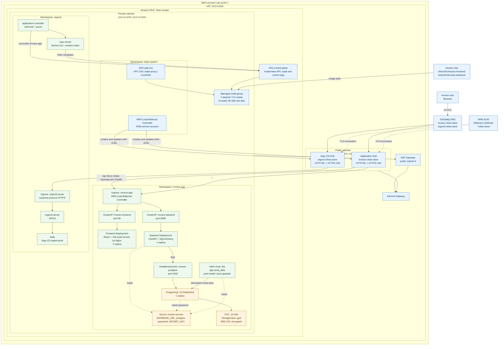
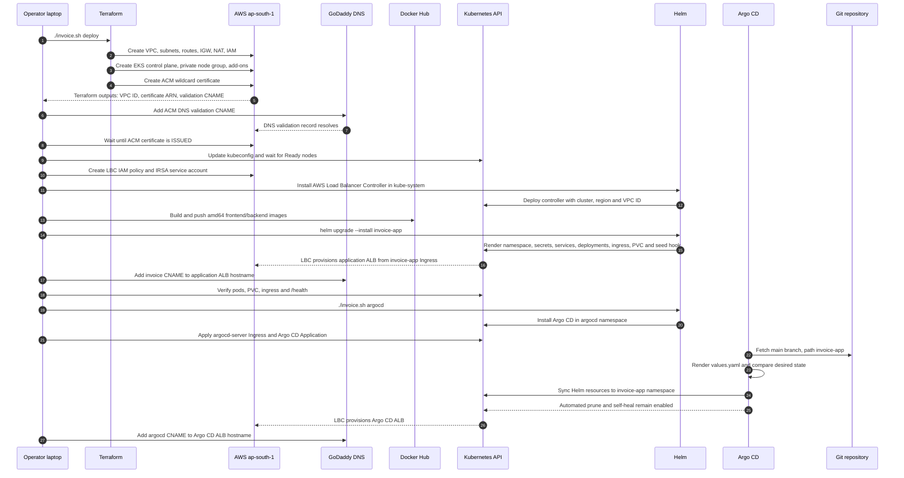

# Jagannath Invoice Application Architecture

This document describes the end-to-end AWS EKS deployment represented by this repository, including the application runtime path, infrastructure provisioning path, and Argo CD GitOps flow.

## 1. End-to-end runtime architecture

### Request routing

| Host and path | ALB target | Kubernetes service | Workload |
| --- | --- | --- | --- |
| `https://invoice.vihan.store/` | Application ALB | `invoice-frontend:80` | Nginx serving the React build |
| `https://invoice.vihan.store/api/*` | Application ALB | `invoice-backend:8000` | FastAPI |
| `https://invoice.vihan.store/docs`, `/redoc`, `/openapi.json`, `/health` | Application ALB | `invoice-backend:8000` | FastAPI |
| `https://argocd.vihan.store/` | Argo CD ALB | `argocd-server:443` | Argo CD server over HTTPS |

The backend is the only application component that connects to PostgreSQL. The frontend calls the backend through the public application host according to its configured API URL and CORS settings.

## 2. Provisioning and deployment flow

## 3. Repository-to-runtime map

| Concern | Source of truth | Runtime result |
| --- | --- | --- |
| Infrastructure | `eks/terraform/*.tf` | VPC, routing, EKS, node group, IAM, ACM and add-ons |
| Deployment orchestration | `invoice.sh` | Ordered bootstrap, image build, Helm deployment and verification |
| Application packaging | `invoice-app/Chart.yaml`, `values.yaml`, `templates/` | Kubernetes resources in `invoice-app` |
| Application image | `backend/Dockerfile`, `frontend/Dockerfile` | Docker Hub images pulled by private EKS nodes |
| Application GitOps registration | `argocd/application.yaml` | Argo CD watches `main` at `/invoice-app` |
| Argo CD public access | `argocd/argocd-ingress.yaml` | HTTPS Argo CD ALB at `argocd.vihan.store` |
| Frontend and API behavior | `frontend/src/`, `backend/app/` | Browser UI, invoice API, PDF generation and database access |

## 4. Network and security boundaries

- Public subnets contain the internet-facing application and Argo CD ALBs.
- EKS worker nodes run only in the two private subnets.
- Private subnet default routes use the NAT Gateway for outbound image pulls and updates.
- ACM terminates client TLS at both ALBs. The Argo CD ALB forwards HTTPS to `argocd-server:443`; the invoice ALB forwards HTTP to the application services.
- The AWS Load Balancer Controller uses an IRSA-backed service account and creates ALB resources from Kubernetes Ingress objects.
- PostgreSQL storage uses the AWS EBS CSI driver, encrypted `gp3`, `ReadWriteOnce`, and a 10 GiB PVC.
- Application credentials are currently rendered into the Helm-created `invoice-secrets` Secret from `invoice-app/values.yaml`. For production, move database credentials and the backend secret key to AWS Secrets Manager or an external-secrets workflow.

## 5. Operational notes

- `./invoice.sh deploy` performs the initial infrastructure and Helm deployment.
- `./invoice.sh argocd` installs Argo CD and registers the application. After that, Git changes under `invoice-app/` are reconciled by Argo CD with automated prune and self-heal.
- The Helm seed Job is a post-install/post-upgrade hook and runs `python3 -m app.seed_data` after PostgreSQL is reachable.
- The PostgreSQL StatefulSet has one replica. This is persistent storage, but it is not a highly available database design.
- `reclaimPolicy: Delete` means deleting the PVC can delete the underlying EBS volume.
- `invoice.sh` contains a hard-coded GitHub token comment. Revoke and rotate that token immediately, then remove it from the file and Git history if it was ever committed.
